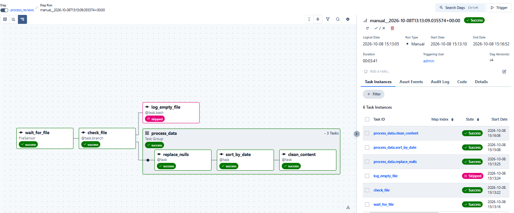
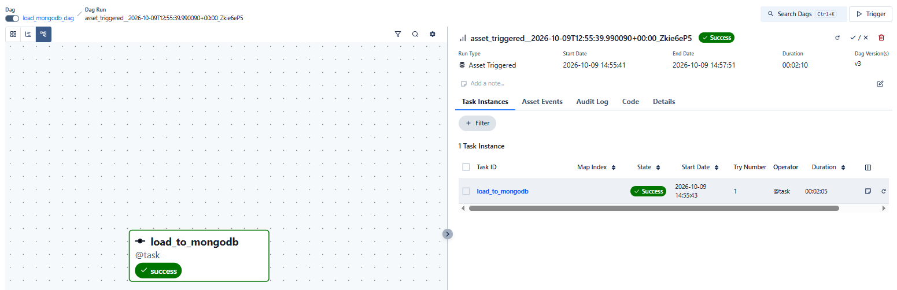

# Apache Airflow 3 — MongoDB ETL Practicum

## Project Overview

This project implements an ETL (Extract, Transform, Load) pipeline using **Apache Airflow 3, Python, Pandas, and MongoDB**.

The pipeline processes a dataset containing TikTok reviews from Google Play, performs data cleaning and sorting, and loads the processed records into MongoDB.

Two Airflow DAGs are connected using **Asset-based (Data-aware) scheduling**, allowing the second DAG to run automatically when the processed dataset is updated.

## Technologies

- Python 3.12
- Apache Airflow 3.3.2
- Pandas 3.0.6
- MongoDB 7
- PyMongo and Airflow MongoDB Provider
- Docker Desktop and WSL2 (Ubuntu 24.04)

## Project Structure

| Path | Description |
|---|---|
| `dags/process_reviews_dag.py` | First DAG: file detection and data processing |
| `dags/load_mongodb_dag.py` | Second DAG: loading processed data into MongoDB |
| `mongo/queries.py` | Three MongoDB aggregation queries written in Python |
| `data/input/` | Directory for the original CSV dataset |
| `data/output/` | Directory for processed CSV files |
| `requirements.txt` | Python dependencies |
| `docs/images/` | Airflow screenshots |

The CSV datasets are excluded from Git to avoid committing large data files.

## DAG 1 — Data Processing

**DAG ID:** `process_reviews`

The first DAG performs the following operations:

1. **FileSensor (`wait_for_file`)** — waits for `tiktok_google_play_reviews.csv` to appear in the input directory.
2. **Branching (`check_file`)** — checks whether the file is empty.
3. **Empty file branch (`log_empty_file`)** — executes a Bash command to log that the input file is empty.
4. **TaskGroup (`process_data`)** — processes non-empty files using three sequential tasks:
   - `replace_nulls` — replaces missing values with `-`.
   - `sort_by_date` — sorts records by the `at` column, representing the review creation date.
   - `clean_content` — removes emoji and unwanted symbols from the `content` column.

Each transformation produces an intermediate CSV file.

The final output is `data/output/reviews_cleaned_content.csv`.

### DAG 1 — Airflow Graph

## Asset-Based Scheduling

The `clean_content` task publishes an Airflow Asset named `reviews_cleaned_content_csv` after successful execution.

The second DAG uses this Asset as its schedule. This allows it to start automatically when the processed dataset is updated, without requiring a manually configured time-based schedule.

## DAG 2 — MongoDB Loading

**DAG ID:** `load_mongodb_dag`

The second DAG contains the task `load_to_mongodb`, which:

1. Reads the processed CSV in batches of 2,000 rows.
2. Converts the `at` column into MongoDB-compatible datetime values.
3. Connects to MongoDB through an Airflow Connection and `MongoHook`.
4. Performs a full refresh of the `tiktok_reviews.reviews` collection.

The verified initial load inserted **307,057 reviews** into MongoDB.

### DAG 2 — Airflow Graph

## MongoDB Aggregation Queries

The analytical queries are implemented in Python using **PyMongo** and MongoDB's Aggregation Framework.

### Query 1 — Top 5 Most Frequent Comments

Groups documents by their `content`, counts occurrences, sorts by frequency, and returns the five most common comments.

### Query 2 — Comments Shorter Than 5 Characters

Uses `$match`, `$expr`, `$lt`, and `$strLenCP` to retrieve all reviews with fewer than five Unicode characters in the `content` field.

### Query 3 — Average Rating Per Day

Uses `$dateTrunc`, `$group`, and `$avg` to calculate the average review score for each day.

The result preserves the date as a MongoDB `Date` value rather than a string.

The initial dataset contained reviews across **79 distinct days**.

## Local Setup

### Requirements

- Python 3.12 and Apache Airflow 3
- Docker Desktop with WSL2 integration
- MongoDB 7
- Dependencies listed in `requirements.txt`

### Configuration

Set the `REVIEWS_PROJECT_DIR` environment variable to the absolute path of this project before starting Airflow.

Configure two Airflow Connections:

| Connection ID | Type | Purpose |
|---|---|---|
| `reviews_filesystem` | File (path) | Points to the `data/input` directory |
| `reviews_mongodb` | MongoDB | Connects to the local MongoDB server |

For the local MongoDB setup, the server uses port `27017`, with authentication configured through the MongoDB Connection.

Credentials are not stored in the source code.

### Running the Pipeline

1. Start Docker Desktop and the MongoDB container.
2. Activate the Python environment and start Airflow.
3. Copy the DAG files into Airflow's configured DAG directory.
4. Ensure both DAGs are enabled.
5. Place `tiktok_google_play_reviews.csv` inside `data/input/`.
6. Manually trigger `process_reviews`.
7. After successful processing, verify that `load_mongodb_dag` starts automatically through the Asset event.

### Running the Analytical Queries

From the project root, execute:

`python mongo/queries.py`

The script requests the MongoDB password interactively and prints the query results.

## Notes

- Large input and output CSV files are excluded from version control.
- MongoDB credentials are managed separately from the source code.
- The MongoDB loader currently uses a full-refresh strategy.
- The successful non-empty-file execution path and Asset-triggered second DAG have been verified.

## Author

Developed as part of the Innowise Python / Apache Airflow practicum.